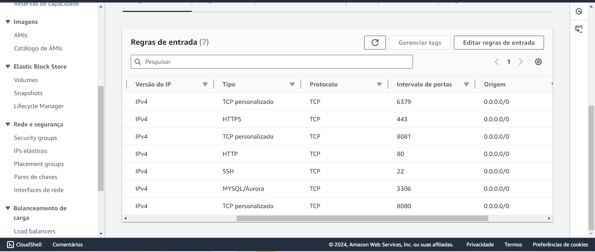

# Tecnologias Utilizadas


---

## Introdução

Este projeto foi desenvolvido utilizando **Python** com o framework **Flask** e aborda a simulação de uma pesquisa de mercado para avaliar a viabilidade da abertura de um novo comércio em uma cidade. A aplicação permite que usuários criem uma conta, realizem login e respondam a um questionário com perguntas como: faixa salarial, quantidade de moradores no domicílio, frequência de compras no supermercado, valor médio das compras mensais, entre outras. O objetivo é coletar dados que auxiliem na análise de perfil dos consumidores da região.

Além da aplicação em si, o projeto também explora conceitos de **infraestrutura de redes** e **orquestração de serviços**. O código-fonte é executado em três máquinas virtuais locais, criadas no **VirtualBox**, que se comunicam com o banco de dados hospedado em uma instância **AWS EC2**. O banco de dados utiliza **MariaDB**, e a comunicação entre as instâncias é feita via **SSH**.

### A arquitetura do projeto inclui:

- **Balanceamento de carga:** Uma das VMs locais utiliza o **Nginx** para distribuir as requisições HTTP entre os servidores de aplicação nas outras duas VMs. Esse balanceamento é implementado por meio de containers gerenciados com **Docker**, onde o Nginx opera como um microserviço.
  
- **Segurança:** A VM responsável pelo balanceamento de carga estabelece um túnel VPN usando **OpenVPN**, garantindo uma camada adicional de segurança na comunicação entre as VMs locais e o banco de dados remoto.

Essa estrutura não apenas ilustra os conceitos de desenvolvimento de aplicações web, mas também foca em práticas modernas de **deploy**, **segurança** e **escalabilidade**, utilizando ferramentas como **Redis**, **Nginx**, **Docker** e **AWS**. Logo abaixo, é apresentado  a topologia da infraesturura do projeto para um melhor entendimento:


# Rodando o Projeto

## Passo 1: Configurações da Instância na AWS

Para começar, acesse o serviço **EC2** da AWS com sua conta. Em seguida, crie uma nova instância do tipo **Ubuntu**, que será o ambiente onde seu banco de dados estará hospedado.

- **Gerando o Par de Chaves RSA:** Durante a criação da instância, será solicitado que você crie um par de chaves RSA. Esse par de chaves é essencial para realizar a conexão via **SSH** com a instância. Guarde o arquivo gerado em um diretório seguro na sua máquina local e **renomeie a extensão do arquivo para `.pem`** para garantir que ele esteja no formato correto para a autenticação.

- **Fixando o IP Público com IP Elástico:** Após criar a instância, vá até a seção **IP Elásticos**, localizada na área de **Redes e Segurança** no menu à esquerda. Crie um novo IP elástico e associe-o à sua instância. Isso é muito importante, pois, sem o IP elástico, o IP público da sua instância mudaria toda vez que a máquina fosse reiniciada, o que poderia gerar problemas no código e na configuração de rede.

- **Configurando os Grupos de Segurança:** Agora, acesse a seção **Security Groups** e edite o grupo de segurança associado à sua instância. Libere a **porta 22** para permitir a conexão SSH, o que será necessário para acessar a instância via terminal **CMD** do Windows ou para estabelecer a comunicação entre as suas VMs locais e a instância na AWS. Além da porta 22, também será necessário liberar outras portas que são essenciais para o funcionamento do projeto, conforme a imagem abaixo:



### Instalação do MariaDB e Redis

Após as configurações iniciais, abra o terminal no Windows, entre no diretório onde a sua chave `.pem` está armazenada e acesse a sua instância AWS via SSH com o seguinte comando:

```bash
ssh -i <chave.pem> ubuntu@<ip público da vm>
```

Agora que você está dentro da VM, vamos realizar algumas configurações e instalar os serviços necessários. Para garantir que o usuário ubuntu tenha permissões para executar comandos administrativos dentro da VM, será necessário adicioná-lo ao grupo de sudoers. Execute o seguinte comando no terminal da sua VM:

```bash
sudo usermod -aG sudo ubuntu
```

Esse comando adiciona o usuário ubuntu ao grupo sudo, permitindo-lhe usar comandos com permissões de superusuário.

Agora, vamos instalar o banco de dados MariaDB. No terminal da sua VM, execute os seguintes comandos:

### Atualize a lista de pacotes
```bash
sudo apt-get update
```

### Instale o MariaDB
```bash
sudo apt-get install mariadb-server -y
```

### Após a instalação, inicie o serviço do MariaDB:
```bash
sudo systemctl start mariadb
```

### Verifique se o MariaDB está em execução com o comando:
```bash
sudo systemctl status mariadb
```

Após instalar o MariaDB, vamos acessar o banco de dados e criar um usuário padrão com todos os privilégios. Execute os seguintes comandos:
```bash
sudo mysql
```

### Crie um novo usuário e conceda privilégios
```bash
CREATE USER 'usuario_padrão'@'localhost' IDENTIFIED BY 'senha_do_usuario';
GRANT ALL PRIVILEGES ON *.* TO 'usuario_padrão'@'localhost' WITH GRANT OPTION;
```

### Saia do MariaDB
```bash
EXIT;
```

Esses comandos criam um usuário usuario_padrão com a senha senha_do_usuario e concedem a ele todos os privilégios no banco de dados.

Por fim, vamos instalar o Redis, que será utilizado para armazenar dados temporários, como informações de login dos usuários. Execute os seguintes comandos:
### Instale o Redis
```bash
sudo apt-get install redis-server -y
```

### Inicie o Redis
```bash
sudo systemctl start redis
```
### Verifique se o Redis está em execução
```bash
sudo systemctl status redis
```

Com esses comandos, o servidor Redis será instalado e iniciado. Você pode verificar o status para garantir que está funcionando corretamente.

## Passo 2: Configurações iniciais das vms locais:

Baixe o Oracle Virtual Box e crie 3 instâncias do tipo Debian com a placa de rede em modo bridge. Na instância, após definir o usuário padrão e configurações iniciais, baixe o Python versão 3.9 com:

```bash
sudo apt update
sudo apt install python3.9
```

Instale o pip na versão que converse com Python 3.9:

```bash
sudo apt install python3-pip
```
Em seguida, baixe o Github em cada VM e baixe o código fonte da aplicação neste repositório com:
```bash
sudo apt install git
git clone https://github.com/WallaceMarinho/Projeto_Seguranca_da_Informacao-Pesquisa_de_Mercado-.git
```

Use o comando abaixo para copiar e colar a chave .pem da sua VM AWS para as suas VMs locais, mantendo ela no diretório oculto .ssh:
```bash
scp -i <caminho_da_chave.pem> ubuntu@<ip_da_vm_aws>:/home/ubuntu/.ssh/<nome_da_chave.pem> ~/.ssh/
```
Entre no diretório git da aplicação e crie um novo arquivo chamado .env a partir do arquivo .env.example para configurar as variáveis de ambiente com seus parâmetros, utilizando o comando:
```bash
cp .env.example .env
```

Edite o arquivo .env para configurar as variáveis de ambiente:
```bash
nano .env
```

Salve e feche o arquivo, e execute o comando abaixo para instalar as bibliotecas necessárias para rodar o código, destacadas em requirements.txt:
```bash
pip install -r requirements.txt
```

Rode o código com:
```bash
python3 so_main.py
```
Certifique-se de que a vm na AWS esteja iniciada. Agora, acesse a aplicação pela URL do seu navegador com o ip da sua vm : porta informada no terminal.

## Passo 3: Configurações do Load Balancer

### Verificando os IPs das VMs Locais
Agora que as VMs locais estão configuradas, o próximo passo é configurar o **load balancer** para distribuir as requisições entre elas de maneira eficiente. Siga os passos abaixo para configurar corretamente o balanceamento de carga com Docker e Nginx.


Primeiro, verifique os endereços IP de suas VMs locais e garanta que eles sejam diferentes. Para isso, utilize o comando:

```bash
ip a
```

Se for necessário alterar o IP de uma das VMs, entre no diretório de configuração de rede e edite o arquivo:
```bash
sudo nano /etc/network/interfaces
```

Após realizar a alteração, reinicie o serviço de rede com o comando:
```bash
sudo systemctl restart networking
```
### Escolhendo a VM Responsável pelo Balanceamento de Carga
Escolha uma das VMs para ser responsável pelo balanceamento de carga entre as outras duas. Para isso, baixe e instale o Docker na máquina escolhida. Execute o comando abaixo para instalar o Docker:

```bash
sudo apt-get update
sudo apt-get install docker.io
```
### Baixando e configurando o servidor Nginx
Agora, baixe o repositório que contém as configurações necessárias para rodar o Nginx em um container Docker. Você pode fazer isso clonando o repositório diretamente no diretório raiz ou na pasta home do seu usuário:
```bash
git clone https://github.com/Rafael-Caje/ProjSurvey.git
```

Dentro do repositório clonado, edite o arquivo nginx.conf para incluir os IPs das outras VMs que irão receber as requisições. Isso permitirá que o Nginx faça o roteamento adequado para cada uma delas.

Você pode também configurar a prioridade de carga de cada VM ajustando a propriedade weight nas configurações do Nginx. Isso garante que as requisições sejam distribuídas conforme a carga de trabalho de cada máquina.

### Iniciando o Container Docker
Após configurar o arquivo do Nginx, inicie o container Docker com o seguinte comando:
```bash
docker compose up -d
```
Isso irá rodar o Nginx dentro de um container Docker, pronto para balancear as requisições.

Para verificar as imagens criadas e os containers que estão rodando, utilize os comandos abaixo:
```bash
docker image ls
docker ps
```

Caso precise parar o container, execute o seguinte comando:
```bash
docker compose down
```
### Etapas finais 
Agora, acesse as VMs que irão receber as requisições HTTP e entre no diretório do projeto. Dentro da pasta static, edite o arquivo styles.css para alterar a cor de fundo da aplicação. Isso ajudará a identificar visualmente em qual VM o balanceamento de carga te redirecionou.

Com o container Docker em execução e o código ativo nas outras VMs, acesse a aplicação através da URL do seu navegador:

```bash
http://<ip-da-sua-vm-load-balancer>:<porta-do-container-docker>
```

Isso permitirá que você visualize como o balanceamento de carga está funcionando, distribuindo as requisições entre as VMs conforme configurado.

## Passo 4: Configurações da VPN com OpenVPN

**Atenção:** A VPN do OpenVPN deve ser instalada na **VM que gerencia o load balancer**, pois ela será responsável por criar o túnel de segurança entre ela, as outras VMs e o nosso PC local.

- **Servidor:** VM do Load Balancer
- **Cliente:** Nosso próprio PC local

## Instalação e configurações da VPN na VM do Load Balancer

1. Instale o OpenVPN:

```bash
sudo apt install openvpn -y
```

Navegue até o diretório de configuração do OpenVPN:
cd /etc/openvpn
ls

Remova os subdiretórios padrão para evitar problemas:
```bash
sudo rm -rf client
sudo rm -rf server
```

Crie o arquivo de configuração para o servidor VPN:
```bash
touch server.conf
sudo nano server.conf
```

Insira as seguintes configurações no arquivo server.conf:
```bash
dev tun
ifconfig 10.8.0.1 10.8.0.2
secret /etc/openvpn/chave
port 1194
proto udp
keepalive 10 120
persist-key
persist-tun
float
cipher AES256
comp-lzo
verb 4
```

Atenção: Em ifconfig, criamos um IP para atrelar à VPN ao invés de usar os IPs das VMs. O OpenVPN não aceita IPs como 192.168.1.230, por isso usamos o formato 10.8.0.x.

Crie o arquivo de configuração do cliente a partir do arquivo server.conf:
```bash
cat server.conf > client.conf
```

Edite o arquivo client.conf:
```bash
sudo nano client.conf
```

Insira as seguintes configurações no arquivo client.conf:
```bash
dev tun
ifconfig 10.8.0.2 10.8.0.1
remote 192.168.1.210
secret C:\\caminho\\para\\sua\\chave
port 1194
proto udp
keepalive 10 120
persist-key
persist-tun
float
cipher AES256
comp-lzo
verb 4
```

Atenção: Em ifconfig, os IPs devem ser invertidos. No server.conf, colocamos o IP do servidor primeiro e, no client.conf, o IP do cliente primeiro. Em remote, coloque o IP privado da VM do load balancer. Em secret, forneça o caminho completo da chave que será criada posteriormente.

## Movendo os Arquivos Necessários
Gere a chave de acesso para a VPN:
```bash
sudo openvpn --genkey --secret chave
```

Exiba o conteúdo da chave e verifique as vereficações do diretório:
```bash
cat chave
ll
```

Mude a propriedade da chave para o usuário comum:
```bash
sudo chown usuario:usuario chave
```
Caso não tenha criado um par de chaves para as outras vms locais, use o comando o comando:
```bash
ssh-keygen -t rsa -b 4096
```

Copie os arquivos chave e client.conf para o diretório /home/usuario:
```bash
cp client.conf /home/usuario
cp chave /home/usuario
```

Transfira a chave .pub para a pasta local do seu PC:
```bash
scp usuario@ip_da_vm:~/.ssh/id_rsa.pub "C:\caminho\para\colar a chave localmente"
```

No Windows, baixe a chave e o arquivo client.conf da VM com:
```bash
scp -i chave.pub usuario@ip_da_vm:/caminho/do/arquivo .
```

Mantenha os arquivos chave e client.conf no mesmo diretório e renomeie o arquivo client.conf para client.ovpn.

Baixe o instalador do OpenVPN [aqui](https://openvpn.net/community-downloads/).

## Rodando o Código e Configurações Finais

Após instalar o OpenVPN no Windows, clique no ícone do OpenVPN (na barra de tarefas, ao lado do ícone de Wi-Fi). Clique com o botão direito, escolha Import, depois Importar Arquivo, e selecione o arquivo client.ovpn. Certifique-se de que a chave está no mesmo diretório e no caminho correto dentro do arquivo.

Na VM do Load Balancer, execute o comando para iniciar o servidor VPN:
```bash
openvpn --config server.conf
```

Atenção: Caso receba um erro indicando que a porta 1194 já está em uso, mate o processo com o comando:
```bash
killall openvpn
```

Depois, execute novamente o comando para iniciar o servidor VPN.

Com o servidor VPN iniciado, vá novamente para o ícone do OpenVPN no Windows, clique com o botão direito e selecione Conectar. Se todas as configurações estiverem corretas, o cliente será conectado ao servidor na VM.

Você também pode editar o arquivo client.ovpn em tempo real clicando com o botão direito no ícone do OpenVPN e selecionando Editar configurações.

## Rodando a VPN em Segundo Plano

Note que, ao executar a VPN, o terminal da VM fica dedicado a essa função. Para continuar trabalhando nas outras funcionalidades, como o load balancer, execute a VPN em segundo plano usando o tmux.

Instale o tmux:
```bash
sudo apt install tmux
```
Crie uma nova sessão no tmux chamada vpn:
```bash
tmux new -s vpn
```
Dentro do novo subterminal, execute o comando:
```bash
openvpn --config server.conf
```
Para sair do subterminal sem interromper o processo, use a combinação de teclas Ctrl + B, seguida de D, ou Ctrl + D e B.

Liste as sessões ativas do tmux:
```bash
tmux list-sessions
```
Para voltar à sessão vpn, execute:
```bash
tmux attach-session -t vpn
```
Para encerrar a sessão vpn, execute:
```bash
tmux kill-session -t vpn
```
Para matar todas as sessões do tmux, execute:
```bash
tmux kill-server
```
Para mudar de uma sessão para outra, use:
```bash
tmux switch -t <nome_da_sessao>
```


