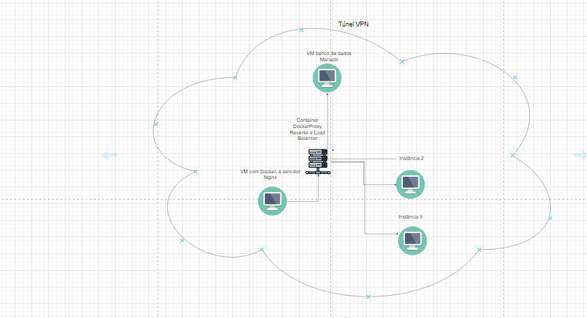

# Tecnologias Utilizadas

---

## Introdução

Este projeto foi desenvolvido utilizando **Python** com o framework **Flask** e aborda a simulação de uma pesquisa de mercado para avaliar a viabilidade da abertura de um novo comércio em uma cidade. A aplicação permite que usuários criem uma conta, realizem login e respondam a um questionário com perguntas como: faixa salarial, quantidade de moradores no domicílio, frequência de compras no supermercado, valor médio das compras mensais, entre outras. O objetivo é coletar dados que auxiliem na análise de perfil dos consumidores da região.

Além da aplicação em si, o projeto também explora conceitos de **infraestrutura de redes** e **orquestração de serviços**. O código-fonte é executado em três máquinas virtuais locais, criadas no **VirtualBox**, que se comunicam com o banco de dados hospedado em uma instância **AWS EC2**. O banco de dados utiliza **MariaDB**, e a comunicação entre as instâncias é feita via **SSH**.

### A arquitetura do projeto inclui:

- **Balanceamento de carga:** Uma das VMs locais utiliza o **Nginx** para distribuir as requisições HTTP entre os servidores de aplicação nas outras duas VMs. Esse balanceamento é implementado por meio de containers gerenciados com **Docker**, onde o Nginx opera como um microserviço.
  
- **Segurança:** A VM responsável pelo balanceamento de carga estabelece um túnel VPN usando **OpenVPN**, garantindo uma camada adicional de segurança na comunicação entre as VMs locais e o banco de dados remoto.

Essa estrutura não apenas ilustra os conceitos de desenvolvimento de aplicações web, mas também foca em práticas modernas de **deploy**, **segurança** e **escalabilidade**, utilizando ferramentas como **Redis**, **Nginx**, **Docker** e **AWS**. Logo abaixo, é apresentado  a topologia da infraesturura do projeto para um melhor entendimento:

# Rodando o Projeto

## Passo 1: Configurações da Instância na AWS

Para começar, acesse o serviço **EC2** da AWS com sua conta. Em seguida, crie uma nova instância do tipo **Ubuntu**, que será o ambiente onde seu banco de dados estará hospedado.

- **Gerando o Par de Chaves RSA:** Durante a criação da instância, será solicitado que você crie um par de chaves RSA. Esse par de chaves é essencial para realizar a conexão via **SSH** com a instância. Guarde o arquivo gerado em um diretório seguro na sua máquina local e **renomeie a extensão do arquivo para `.pem`** para garantir que ele esteja no formato correto para a autenticação.

- **Fixando o IP Público com IP Elástico:** Após criar a instância, vá até a seção **IP Elásticos**, localizada na área de **Redes e Segurança** no menu à esquerda. Crie um novo IP elástico e associe-o à sua instância. Isso é muito importante, pois, sem o IP elástico, o IP público da sua instância mudaria toda vez que a máquina fosse reiniciada, o que poderia gerar problemas no código e na configuração de rede.

- **Configurando os Grupos de Segurança:** Agora, acesse a seção **Security Groups** e edite o grupo de segurança associado à sua instância. Libere a **porta 22** para permitir a conexão SSH, o que será necessário para acessar a instância via terminal **CMD** do Windows ou para estabelecer a comunicação entre as suas VMs locais e a instância na AWS. Além da porta 22, também será necessário liberar outras portas que são essenciais para o funcionamento do projeto, conforme a imagem abaixo:

